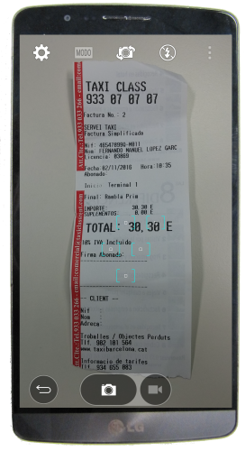
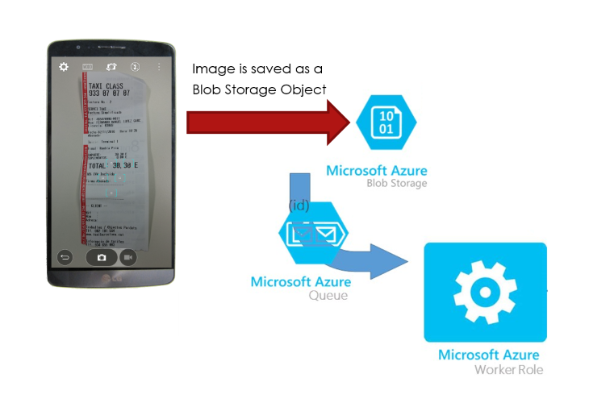
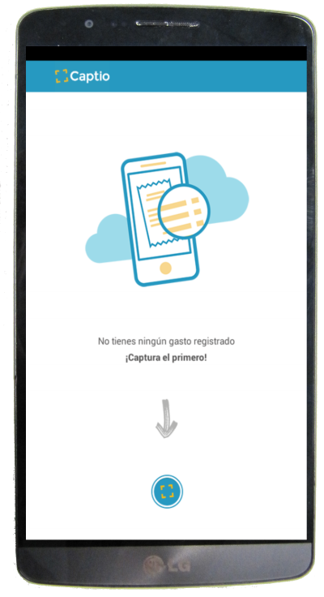
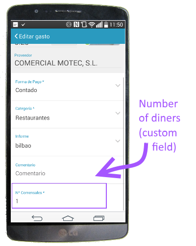
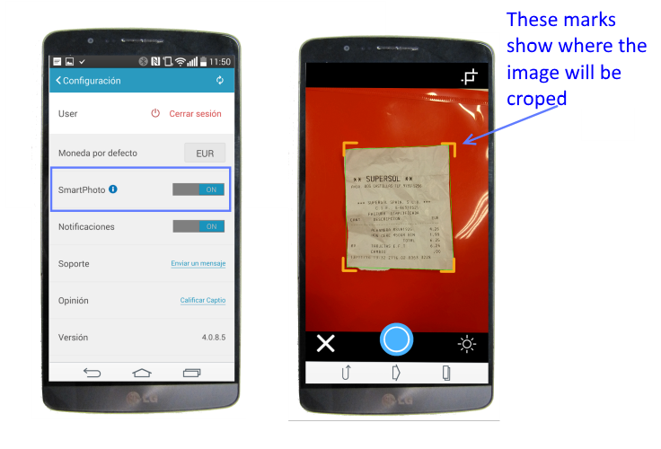

## Learning from Building a Mobile Application with *Captio* ##

A team from Microsoft, our MVP Xamarin-expert and some crew from Captio set out to migrate the original Captio version in Xamarin Classic to Xamarin Froms.
In addition, we created a new backend architecture in Azure, to avoid system downtimes that the application had , specially by the end of the month when they have peaks of usage. 
The team was also able to incorporate an innovative feature into the final product using Azure Notification Hubs.

Core Team: 
- Lluis Claramonte ([@lluisclor](https://twitter.com/lluisclor)) –  Captio CTO
- Marc Rubiño ([@marc_rubino](https://twitter.com/marc_rubino)) – Microsoft MVP, Captio CIO
- Isabel Cabezas ([@isabelcabezasm](https://twitter.com/isabelcabezasm)) – Technical Evangelist, Microsoft
- Ester de Nicolás ([@esterdenicolas](https://twitter.com/esterdenicolas)) – Technical Evangelist Mngr, Microsoft

Our challenge, supported by one of our MVPs, is to change the application to use **Xamarin Forms**. Changing the technology and **teaching** the whole developer team about Xamarin. After one week of **hack fest** and some more help of our MVP, the **goal is achieved**. All the developers can work with the same technology for the front-end layer. 
They have **reduced** the **amount of code**, **equalized the appearance in all platforms**, reduced the **complexity** (deleting useless patterns and using MVVM by default) and, also,  they can **customize the appearance** of the application for some clients, depending of their client’s needs.
About the **backend**, we have migrated some functionality to a **Worker Role** and we added **Push Notifications** to the app.

Key Technologies:
- Xamarin Forms			
- Push Notification / Notification Hubs			 
- OpenCV 
- Service Bus
- Worker Roles
 
## Customer Profile ##

Captio started five years ago developing an application that enables companies and their employees an improved control of their **travel expenses**. Captio app integrates the expense management process into a single, **paperless workflow**, eliminating the need for manual tasks and **preventing fraud**. 
Their services belong to the **financial vertical market**, but among their customers are banking, insurance and healthcare, telecommunications, engineering, food and beverage and many more. 
It is absolutely the leading application in the **digital transformation** field, not only in **Spain** since they are also opening markets in **South America**. 
We know them since a few years ago, because they were one of our more successful startups in our BizSpark Plus program in Spain, and now we continue working closely with them in our ISV program. We can't speak about success stories in BizSpark without referring Captio.
 
## Problem Statement ##
### (About their technological context) ###
Captio built their **app first version** using **Phone Gap**, five years ago, but they were not convinced by the results because capabilities were more or less available on most devices, but some were not as good as native. The performance neither was as good as they expected. 
Then they developed the application again. This time they did three native applications, helped by some partners, for the three platforms more used: Android, iPhone, and Windows Phone. Both performance and capabilities achieved their expectation, so the three applications were maintained independently for a while, bearing the costs.  
Over time the CEO heard about **Xamarin** and its biggest **advantage**: they can **share** the logic layer **code** between their applications, save costs in maintenance, and the application still is native. They tried it and results were good, so for the last years, they have been working in the application, built with **Classic Xamarin**. 

In other hand, all the **backend** of Captio was hosted in **Azure**, and they have a monolithic architecture, using mainly **virtual machines**. They cannot use the auto scale and have downtimes, specially by the end of the month when they have peaks of usage. 

## Solutions, Steps, and Delivery ##

*[Our Proposal]*

* Change from their **Xamarin Classic** app to **Xamarin Forms**.

* Add some functionality for **improving** the **UX**. 
  For example:

	* The user don’t need to use the lateral menu if you only want to take the photo, the button was moved to the main screen.

	* Added an automatic trimming of the photo (improving image- capture process)

	* Added the option of select a picture from gallery
	
* Migrate some functionality from **Azure IaaS to PaaS** (migrating some heavy process to a Service that can auto scale).

*[Benefits]* 		

* Reduced the amount of code New look & feel 
* Equalized the appearance in all platforms, 
* Reduced the complexity (deleting useless patterns and using MVVM by default) 
* Easier customize the appearance of the application for some clients, depending of their client’s needs. 
* Improved image-capture process
* Migrated OCR reading into a Worker Role  
* Added Push Notifications to the app. 

### From Xamarin Classic to Xamarin Forms  
As a cross-platform UI API, Xamarin.Forms enables developers to create and share user interfaces across iOS, Android and Windows Phone. At the same time, they have option to use native controls of each mobile platform while creating the user interface. Thus, it becomes easier for them to customize the user interface’s look and feel of the user interface for individual mobile platforms.

Equalized appearance in all platforms:

### Understanding the utility of the app and its dataflow ###

Captio in an app that helps you to do the accounts, either your personal accounts or the company’s finances. It automatically extracts the data from the receipts and invoices that you capture with your smartphone, so you’ll never have to type expenses manually again.

You can generate expense reports with your smartphone, charts, graphs and to know more about your expenses, or build a workflow for your company’s expenses, automate the tasks required to control and manage your team’s expenses.
Captio is easy to use. A system tailored to your users. Simple and hassle-free for the people travelling and those that supervise them.

Once the ticket has been uploaded as a Blob, we have a Worker Role who is notified through an Azure Queue. The message of the Queue includes the blob object ID. 

When the Worker Role receives the message, access to the blob, and runs an OCR process over the image to extract the data of the ticket.
Once the worker role does OCR reading, stores the data extracted in Azure SQL

When the image has been read, data is automatically updated.
Now you could modify the expense category, or some information about the ticket.

#### Taking the picture ####
Use your mobile phone camera to get a photo of the expense ticket.

One of our updates in the Azure infrastructure is isolating the uploading picture.
Now it’s saved as a Blob object into Azure Storage.

### Improving the UX and adding new features ###

#### The first time we open the application ####

In the previous version, the first screen that the user see when he/she opens the application is a menu, and no more instructions or usage guide. In addition, first time the app is opened, it must load some stuff and synchronize your data, so the user experience could be inadequate.

**Warm up**

First time the app is opened, while it loads data and synchronize your user information, we added a progress screen where can visualized the progression of the procedure with amusing and vintage sentences like “Cleaning the objective of the camera” or “loading the film roll”.

**Wizard / usage guide**

In our new version, we have a usage guide of three images which explain very concise how the application must be used.

**Just use it!** 

After that, and the first screen the user will see from the first time, is one with a simple design: just a button to take the photo.
Get your first photo. 

#### Custom fields ####

Custom fields could be added to some categories, like in the demo, when the expense is categorized as “Restaurant” we have added “Number of diners” as new field.

#### SmartPhoto ####
An automatic trimming of the photo has been added.
The edge of the ticket is detected and the photo is cut. So only the important part of the image is saved.
It improves the capturing-image process and speed up it.

## Architecture ##
### (explained from dataflow) ###

Once the photo is taken, it is uploaded to a Blob Storage.
The OCR reading is made by a worker role.
The data extracted from the OCR reading are saved in an Azure SQL.

### Azure ###

Original Architecture:

New distributed Architecture:

## Conclusion ##
//Measurable impact resulting from the implementation of the solution

## General lessons ##
//Bulleted list of insights the team came away with

//What can be applied or reused in other environments or other customers?

## Additional Resources ##

[Documented Demo](https://microsoft-my.sharepoint.com/personal/isacabe_microsoft_com/_layouts/15/guestaccess.aspx?guestaccesstoken=%2bgvqKQBT0ockoXL3InNCE0G%2bQ44NTwa8HvxCWhCxkHc%3d&docid=2_066e9b0c0e87647c3812b40eff99061c9&rev=1)

[Demo Video](https://microsoft-my.sharepoint.com/personal/isacabe_microsoft_com/_layouts/15/guestaccess.aspx?guestaccesstoken=ylMQwgHP5jbxZIxcklJ%2fwu44q6FJI7A4LDEOFxHNk%2bU%3d&docid=2_05559c316dd834e1f808a37e572ed8ff5&rev=1)

